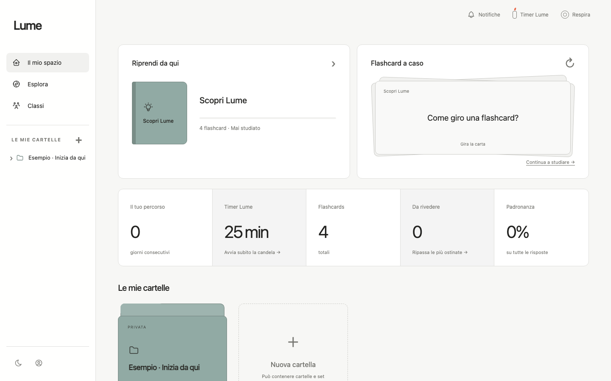

# Lume

**A local-first flashcard workspace designed to turn rough notes into focused study sessions.**

[Try the live app](https://collivignarellioffice-byte.github.io/lume-flashcards/) · [See the portfolio case study](https://martinacollivignarelli.com/#lume)



## The problem

Most flashcard tools make the user choose between speed and control. Simple tools are quick but rigid; feature-rich platforms often add setup friction before the first study session.

Lume starts in the browser with a working sample set. The user can then create folders, prepare cards from Markdown, choose how a set behaves, and study without an account. Sign-in is optional and adds private synchronization across devices.

## Try it in 90 seconds

1. Open the [live demo](https://collivignarellioffice-byte.github.io/lume-flashcards/). No account is required.
2. Open **Esempio · Inizia da qui**, then **Scopri Lume**.
3. Start a study session. Tap the card or press the space bar to reveal the answer.
4. Try **Keyword Help** and the contextual **Lato Esempio**.
5. Mark the answer with **La so** or **Non ancora** and review the result.

The sample remains private in the visitor's browser and can be edited or removed like any other set.

## What I built

- a local-first library of folders, sets, and flashcards;
- study and test flows with sequential or random order and front-first or back-first direction;
- **Keyword Help**, which temporarily keeps only selected recall anchors visible;
- **Lato Esempio**, a third contextual side that masks the answer until it is revealed;
- Markdown import and reusable prompts for preparing standard cards, keywords, and examples;
- optional Google or email/password authentication with private Firestore sync;
- a public library where signed-in users can publish and rate shared sets;
- search, lightweight progress statistics, timers, ambient audio, themes, and responsive layouts.

## Product and technical decisions

| Decision | Reason |
| --- | --- |
| Useful before sign-in | A recruiter or new user can understand the product without registration friction. |
| Local-first storage | Creation and study continue immediately, while an account remains optional. |
| Guided sample as real data | Onboarding demonstrates the same objects and controls the user will later create. |
| Separate private and public paths | Personal libraries stay isolated while published sets remain discoverable. |
| Prompts instead of a hidden AI dependency | Users can prepare content with the model they choose, inspect the Markdown, and import a predictable format. |
| Static GitHub Pages build | The portfolio demo is inexpensive, reproducible, and directly connected to this repository. |

## Architecture

```text
Browser
  ├─ React + TypeScript interface
  ├─ localStorage for the guest library
  └─ optional Firebase Authentication
       └─ Firestore
            ├─ private library per user
            └─ readable public sets

GitHub Actions → Vite build → GitHub Pages
```

Firestore rules keep each authenticated user's private library separate. Public sets are stored through a dedicated publication path and can be read without exposing the owner's private workspace.

## Stack

- React 19 and TypeScript
- Vite and Vinext
- Firebase Authentication and Firestore
- CSS responsive design without a component framework
- Node test runner
- GitHub Actions and GitHub Pages

## Run locally

Node.js 22.13 or later is required.

```bash
pnpm install
pnpm dev:pages
```

Then open the local URL shown by Vite.

Useful commands:

```bash
pnpm test           # Vinext build, source/render checks, and Pages build
pnpm build:pages    # static output in gh-pages/
pnpm lint
```

## Current boundaries

- The app does not call an AI model directly. It provides constrained prompts and a documented Markdown format for user-controlled preparation.
- Guest data belongs to the current browser. Cross-device sync requires sign-in.
- Lume is a portfolio product and learning project, not a commercial learning platform with institutional administration or formal learning analytics.

## My role

I designed the product flows, interaction model, visual system, data model, Firebase integration, and deployment. I used AI-assisted coding as an implementation partner while keeping product decisions, acceptance criteria, testing, and iteration under my direction.

Built by [Martina Colli Vignarelli](https://martinacollivignarelli.com/).
